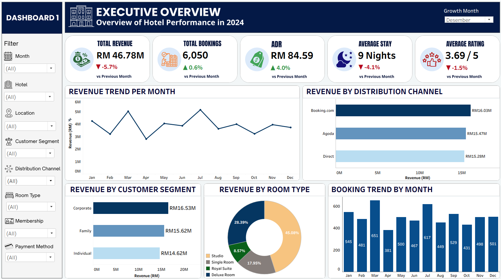
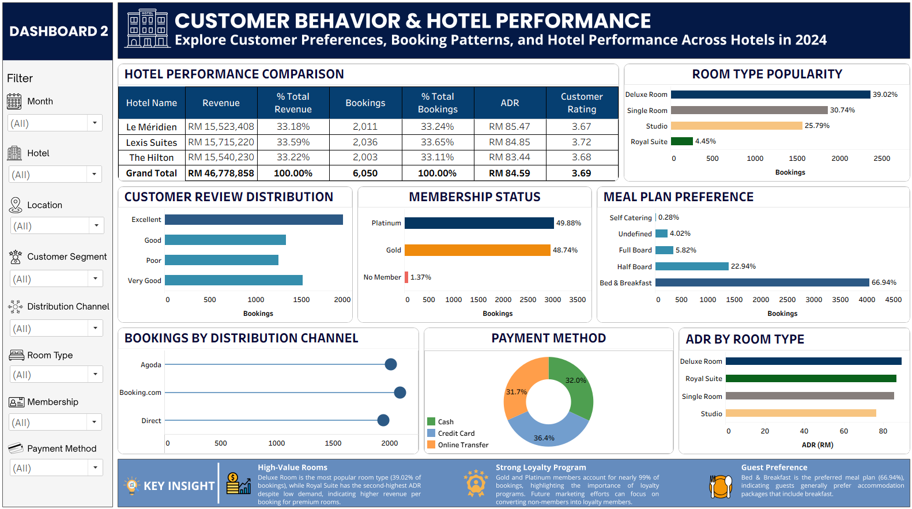

# 🏨 Hotel Booking Performance Dashboard

An interactive **Business Intelligence Dashboard** built using **Tableau** to analyze hotel booking performance, customer behavior, room preferences, and revenue trends across multiple hotels in 2024.

The dashboard transforms raw transactional booking data into meaningful business insights through interactive visualizations, KPI monitoring, customer segmentation, and hotel performance analysis.

---

## 📌 Project Overview

The hospitality industry relies heavily on data-driven decision making to improve operational efficiency, increase revenue, and enhance customer experience.

This project analyzes hotel booking transactions from multiple hotels throughout 2024 to answer key business questions related to revenue performance, customer preferences, membership programs, booking channels, and room performance.

The final deliverable is an interactive Tableau dashboard consisting of two dashboards designed for management reporting and business decision-making.

---

# 🎯 Business Objectives

This dashboard aims to answer the following business questions:

- How is overall hotel business performance throughout 2024?
- Which room types contribute the highest booking volume?
- Which customer segments generate the most revenue?
- How effective are loyalty membership programs?
- Which booking channels contribute the most bookings?
- What meal plans are preferred by customers?
- How do hotels compare in terms of revenue, ADR, bookings, and customer ratings?

---

# 📊 Dashboard Overview

## Dashboard 1 — Executive Overview

Provides an executive-level summary of overall hotel performance.

### Key Performance Indicators (KPIs)

- 💰 Total Revenue
- 🏨 Total Bookings
- 💵 Average Daily Rate (ADR)
- 🌙 Average Stay Duration
- ⭐ Average Customer Rating

### Visualizations

- Revenue Trend
- Booking Trend
- Revenue by Distribution Channel
- Revenue by Customer Segment
- Revenue by Room Type

---

## Dashboard 2 — Customer Behavior & Hotel Performance

Provides deeper analysis of customer behavior and hotel performance.

### Visualizations

- Hotel Performance Comparison
- Room Type Popularity
- Customer Review Distribution
- Membership Status
- Meal Plan Preference
- Bookings by Distribution Channel
- Payment Method Distribution
- ADR by Room Type

---

# 📷 Dashboard Preview

## Dashboard 1

<p align="center">

</p>

---

## Dashboard 2

<p align="center">

</p>

---

# 📈 Key Business Insights

## 🏨 Premium Room Types Generate Higher Revenue per Booking

Deluxe Room is the most popular room type, accounting for **39.02%** of all bookings.

Meanwhile, Royal Suite records one of the highest Average Daily Rates (ADR) despite having relatively low booking volume, indicating stronger revenue generated per booking for premium room categories.

---

## 🎖 Strong Customer Loyalty

Nearly **99%** of bookings come from **Gold** and **Platinum** members.

This indicates a highly engaged loyalty customer base while highlighting an opportunity to convert the remaining non-member customers into loyalty program members.

---

## 🍽 Bed & Breakfast Dominates Customer Preferences

Bed & Breakfast represents approximately **67%** of all meal plan selections.

This suggests that guests generally prefer accommodation packages that include breakfast.

---

# 🛠 Tools & Technologies

- Tableau Desktop
- Microsoft Excel

---

# 📚 Skills Demonstrated

### Business Intelligence

- Interactive Dashboard Development
- KPI Design
- Business Performance Monitoring
- Executive Reporting

### Data Visualization

- Tableau Dashboard Design
- Storytelling with Data
- Interactive Filtering
- Comparative Analysis

### Business Analytics

- Revenue Analysis
- Customer Behavior Analysis
- Hotel Performance Analysis
- Customer Segmentation
- Membership Analysis
- Distribution Channel Analysis

---

# 📂 Dataset Information

Dataset: [Hotel Transaction 2024 (Kaggle)](https://www.kaggle.com/datasets/tianrongsim/hotel-sales-2024)

The dataset contains hotel booking transaction records from multiple hotels during 2024.

### Main Variables

- Hotel Name
- Booking Date
- Customer Information
- Customer Rating
- Membership Status
- Distribution Channel
- Room Type
- Meal Plan
- Payment Method
- Revenue
- Average Daily Rate (ADR)
- Length of Stay

---

# 📁 Repository Structure

```text
Hotel-Booking-Performance-Dashboard
│
├── Dashboard
│   └── Hotel Booking Dashboard.twbx
│
├── Dataset
│   └── hotel_transactions_2024.xlsx
│
├── Images
│   ├── Dashboard1.png
│   └── Dashboard2.png
│
└── README.md
```


---

# 📌 Project Highlights

✔ Interactive Tableau Dashboard

✔ Executive KPI Dashboard

✔ Customer Behavior Analysis

✔ Hotel Performance Comparison

✔ Revenue Analysis

✔ Membership Analysis

✔ Distribution Channel Analysis

✔ Room Performance Analysis

✔ Business Storytelling
